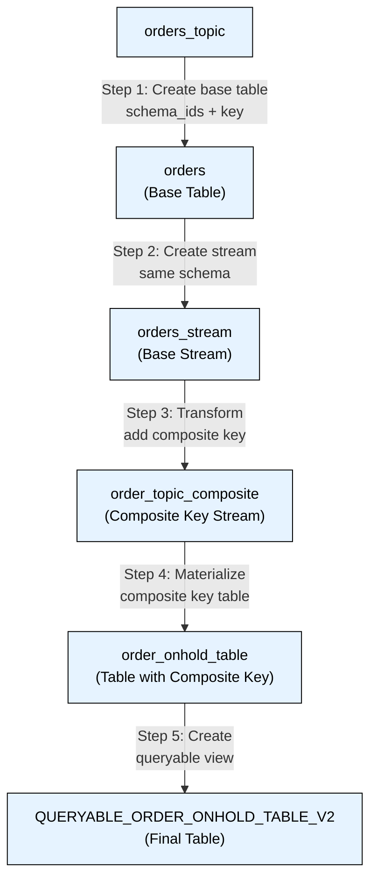

# Pipeline Explanation

## Flow Description:

1. **Source Data (orders_topic)**
   - Raw data enters through the Kafka topic 'orders_topic'
   - Uses AVRO format for both key and value

2. **Base Table (orders)**
   - Created with schema IDs (100145 for key, 100146 for value)
   - Contains all order fields with 'key' as PRIMARY KEY
   - Partitioned into 6 partitions

3. **Stream Layer (orders_stream)**
   - Creates a stream view of the orders data
   - Maintains same schema and format as orders table
   - Enables data transformation

4. **Composite Key Transform (order_topic_composite)**
   - Transforms data by creating a composite key structure
   - Repartitions data based on multiple fields:
     - mgmtCode
     - dlrCode
     - srcID
     - actnCode
     - trxnRevn

5. **Materialized View (order_onhold_table)**
   - Table with composite key as PRIMARY KEY
   - Structured for efficient querying
   - Maintains same partitioning scheme

6. **Query Interface (QUERYABLE_ORDER_ONHOLD_TABLE_V2)**
   - Final queryable table
   - Optimized for querying with composite key fields
   - Enables filtering on any combination of composite key fields

## Query Example:
```sql
SELECT * FROM QUERYABLE_ORDER_ONHOLD_TABLE_V2 
WHERE composite_key->MGMTCODE = 'MGMT00'
  AND composite_key->DLRCODE = 'D010'
  AND composite_key->SRCID = 'SRC147'
  AND composite_key->ACTNCODE = 'NEW'
  AND composite_key->TRXNREVN = '2';
```
